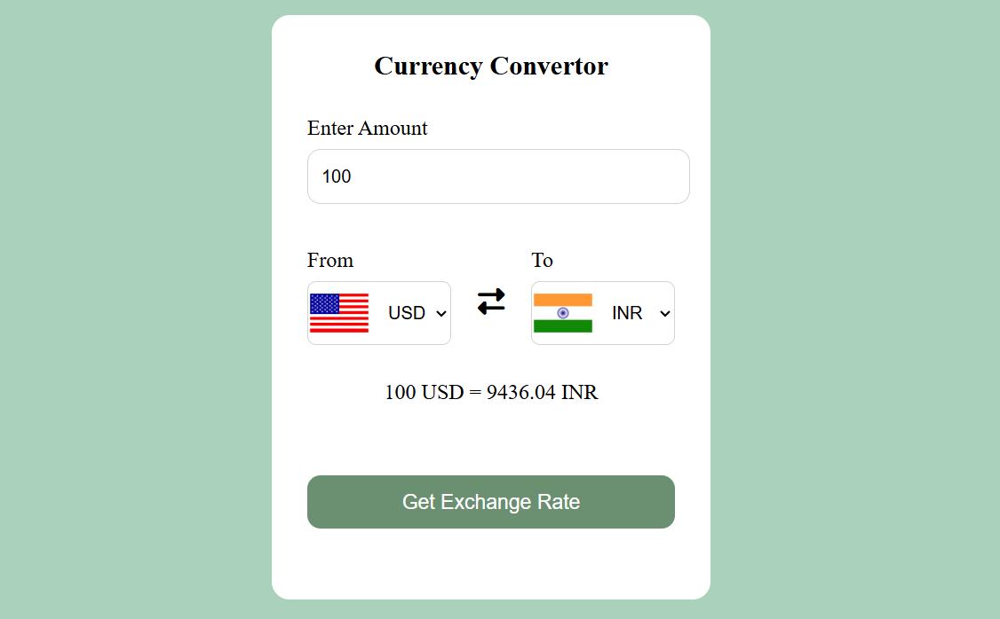

# 💱 Currency Converter

## 📸 Preview



---

## 📌 Overview

A simple and responsive **Currency Converter Web App** built using **HTML, CSS, and Vanilla JavaScript**.
It fetches real-time exchange rates using a public API and dynamically updates currency values with country flags.

This project demonstrates **API integration, DOM manipulation, and event handling**.

---

## 🚀 Features

*  Convert between multiple international currencies
*  Real-time exchange rates using API
*  Country flags update dynamically based on selected currency
*  Default conversion (USD → INR on load)
*  Instant calculation on button click
*  Handles invalid/empty input (defaults to 1)
*  Clean and minimal UI

---

## 🛠️ Tech Stack

* **HTML5** – Structure
* **CSS3** – Styling & Layout
* **JavaScript (Vanilla)** – Logic & API handling
* **Exchange Rate API** – Currency data
* **Flags API** – Country flag images

---

## ⚙️ How It Works

* Currency dropdowns are populated dynamically using a **country list object**
* On selection change:

  * The **flag updates automatically**
* On clicking **"Get Exchange Rate"**:

  * API fetches latest conversion rate
  * Final converted value is calculated and displayed

---

## 🎮 How to Use

1. Enter an amount
2. Select currencies (From → To)
3. Click **"Get Exchange Rate"**
4. View the converted result instantly

---

## 📂 Project Structure

```
📁 Currency-Converter
│── index.html    
│── style.css     
│── app.js       
│── codes.js       
```

---

## 🌐 Live Demo

https://currency-converter-smoky-beta.vercel.app/

---

## 👩‍💻 Author

**Drishti Gupta**
GitHub: https://github.com/drishtiguptaa

---

